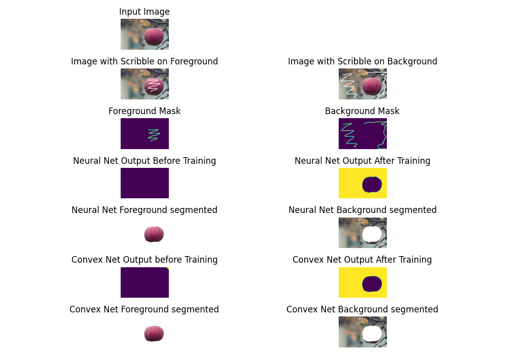

# Scribble-based-Image-Segmentation



## Introduction

A streamlined architecture is designed for the segmentation of convex shapes within images, utilizing scribbles provided by the user. This incorporates a primary model that segments pixels into distinct foreground and background areas. The output from this primary model is then processed through a Convex network. This network enhances the segmentation by ensuring the foreground pixels conform to a convex shape, characterized by unbroken and smooth outlines. Notably, this architecture is optimized for memory conservation and operates effectively without the need for extensive image training datasets, rendering it ideal for practical scenarios with limited computational resources.

This has been accomplished using two approaches:

* Approach 1: Generating the convex segmented image using a fully connected network and convex network architecture.

* Approach 2: Generating the convex segmented image using a pre-trained segmentation network and convex network architecture.

## Requirements

See requirements.txt file

## Setup

1.  Install PyTorch and other required Python libraries in a virtual environment using one of the following commands:

    ```
    pip install -r requirements.txt
    conda env create -f environment.yml
    ```

2.  Collect Data:

    Foreground and background scribbles are to be made on Images that need to be segmented. Save them in the data folder.

    For example, data floder contains the folder single_apple which contains the input image, scribble_fg and scribble_bg.
    
    All the data to be stored in a similar way.
    

## Usage

`python main.py` executes and runs the code with all the default arguments.

For changing the default arguments follow the below instructions:

1. Input: Specify the folder containing the image to segment:

    `python main.py --inputpath data/single_apple/`

2. Primary model selection: 

    There are 2 primary model options to use.

    * Neural net : 
    
    `python main.py -pm neuralnet`

    * Segmentation net (from PyTorch’s segmentation models library): 
    
    `python main.py -pm segmentationnet`

3. Primary model parameters:
    
    Batch size, epochs, learning rate, and hidden units are some of the neural net parameters that can be altered through command line.

    `python main.py -pm neuralnet -nnbs 64 -nne 100 -nnlr 0.00001 -nnhu 256`

    Batch size, epochs, learning rate are some of the segmentation net parameters that can be altered through command line.

    `python main.py -pm segmentationnet -snbs 64 -sne 100 -snlr 0.0001`

4. Convex net parameters:
    
    Batch size, epochs, learning rate, hidden units are some of the convex net parameters that can be altered through command line.
    
    `python main.py -pm neuralnet -nnbs 64 -nne 100 -nnlr 0.00001 -nnhu 256 -cnbs 64 -cne 50 -cnlr 0.00001 -cnhu 256`
                                                
    # or

    `python main.py -pm segmentationnet -snbs 64 -sne 100 -snlr 0.0001 -cnbs 64 -cne 50 -cnlr 0.00001 -cnhu 256`

## Outputs

The output of the network is saved in repective data folder. Output contains result.png, model configurations, terminal output and logs of tensorboard.
